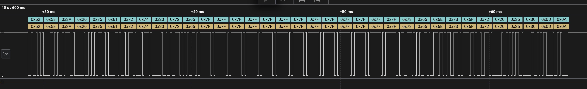

# 4-UartTxRx - Bare-Metal USART2 Transmit And Receive

This project extends the USART2 transmit example into a simple blocking UART RX/TX application. The firmware prints a ready message, waits for text from the host computer, then echoes the received line back with an `RX:` prefix.

## Target

```console
Board: NUCLEO-F091RC
MCU:   STM32F091RCTx
Core:  Arm Cortex-M0
UART:  USART2
TX:    PA2
RX:    PA3
Baud:  9600
Frame: 8 data bits, no parity, 1 stop bit
Logic: 3.3 V, non-inverted UART, idle high
```

## Project Structure

```console
4-UartTxRx/
  Inc/
    uart.h
  Src/
    main.c
    syscalls.c
    sysmem.c
    uart.c
  Startup/
    startup_stm32f091rctx.s
  STM32F091RCTX_FLASH.ld
```

CMSIS headers are stored in the shared repository folder:

```console
chip_headers/CMSIS/Device/ST/STM32F0xx/Include
chip_headers/CMSIS/Include
```

## STM32CubeIDE Import

For the full STM32CubeIDE v1.13-to-v2.2.0 import flow with screenshots, see the root repository README section:

```console
Import Old Projects Into STM32CubeIDE 2.2.0
```

```console
File > Import... > General > Existing Projects into Workspace
```


Import both:

```console
4-UartTxRx
chip_headers
```


## Required Compiler Include Paths

Configure the real compiler include paths under `C/C++ Build`:

```console
Right-click 4-UartTxRx
Properties
C/C++ Build
Settings
Tool Settings
MCU/MPU GCC Compiler
Include paths
```


Use:

```console
Configuration: All configurations
```

Add:

```console
../Inc
${workspace_loc:/chip_headers/CMSIS/Device/ST/STM32F0xx/Include}
${workspace_loc:/chip_headers/CMSIS/Include}
```


## Required Compiler Symbols

Configure symbols under:

```console
Right-click 4-UartTxRx
Properties
C/C++ Build
Settings
Tool Settings
MCU/MPU GCC Compiler
Preprocessor
```

This screenshot shows the correct page. If only `STM32F091RCTx` exists, add `STM32F091xC` as shown in the list below.


Add:

```console
STM32
STM32F0
STM32F091RCTx
STM32F091xC
NUCLEO_F091RC
```


`STM32F091xC` is the important CMSIS macro. `STM32F091RC` is not the device-selection macro used by `stm32f0xx.h`.

## Build And Flash

```console
Project > Clean...
Right-click 4-UartTxRx > Build Project
Right-click 4-UartTxRx > Debug As > STM32 Cortex-M C/C++ Application
```


Recommended debug settings:

```console
Application: Debug/4-UartTxRx.elf
Interface:   SWD
Reset mode:  Connect under reset
SWV:         Disabled
```

## Code Walkthrough

`main.c` initializes USART2, prints a startup message, waits for a line from the terminal, then echoes it back:

```c
int main(void)
{
    char rx_buffer[32];

    uart_tx_rx_init();
    uart_transmit("UART TX/RX ready\r\n");
    uart_transmit("Type text and press Enter:\r\n");

    while (1)
    {
        uart_read_line(rx_buffer, sizeof(rx_buffer));

        uart_transmit("RX: ");
        uart_transmit(rx_buffer);
        uart_transmit("\r\n");
    }
}
```

USART2 TX/RX initialization configures PA2 and PA3 as alternate function 1:

```c
GPIOA->MODER &= ~((3U << (2U * 2U)) | (3U << (2U * 3U)));
GPIOA->MODER |=  ((2U << (2U * 2U)) | (2U << (2U * 3U)));

GPIOA->AFR[0] &= ~((0xFU << (4U * 2U)) | (0xFU << (4U * 3U)));
GPIOA->AFR[0] |=  ((1U   << (4U * 2U)) | (1U   << (4U * 3U)));
```

USART2 is configured for 9600 baud and both transmitter and receiver are enabled:

```c
RCC->APB1ENR |= UART2EN;

USART2->CR1 &= ~USART_CR1_UE;
USART2->BRR = compute_uart_bd(APB1_CLK, UART_BAUDRATE);
USART2->CR1 = USART_CR1_TE | USART_CR1_RE;
USART2->CR2 = 0U;
USART2->CR3 = 0U;
USART2->CR1 |= USART_CR1_UE;
```

String transmit sends one byte at a time until the null terminator:

```c
void uart_transmit(const char *send)
{
    while (*send != '\0')
    {
        uart_write_byte((uint8_t)*send);
        send++;
    }
}
```

Byte receive waits until the RX data register is not empty, then reads `RDR`:

```c
uint8_t uart_read_byte(void)
{
    while (!uart_data_available()) {}

    return (uint8_t)(USART2->RDR & 0xFFU);
}
```

Line receive stores characters until Enter is pressed or the buffer is full:

```c
void uart_read_line(char *buffer, uint32_t length)
{
    uint32_t index = 0U;

    if (length == 0U)
    {
        return;
    }

    while (index < (length - 1U))
    {
        char received = (char)uart_read_byte();

        if ((received == '\r') || (received == '\n'))
        {
            break;
        }

        buffer[index] = received;
        index++;
    }

    buffer[index] = '\0';
}
```

## Terminal Test

Connect the Nucleo board through the ST-LINK USB connector. On macOS, find the serial port:

```bash
/bin/ls /dev/cu.usbmodem*
```

Open the port:

```bash
screen /dev/cu.usbmodem212403 9600
```

Use your actual `/dev/cu.usbmodem*` name.

Expected startup text:

```console
UART TX/RX ready
Type text and press Enter:
```

Type:

```console
hello
```

Expected echo:

```console
RX: hello
```


Exit `screen`:

```console
Ctrl-A
K
Y
```

## Logic Analyzer Test

Connect:

```console
Analyzer GND -> Nucleo GND
Analyzer D0  -> PA2 / USART2_TX
Analyzer D1  -> PA3 / USART2_RX
```

Decoder settings:

```console
Analyzer:       Async Serial
Bit rate:       9600
Data bits:      8
Parity:         None
Stop bits:      1
Bit order:      LSB first
Signal:         Non-inverted
Idle level:     High
Sample rate:    1 MS/s minimum, 5-10 MS/s recommended
Logic voltage:  3.3 V
```

When the board prints the prompt, activity appears on TX. When you type into the terminal, activity appears on RX. When the firmware echoes the message, TX becomes active again.


## Verified UART Echo Capture

The following logic-analyzer capture proves that the firmware received a typed message and transmitted the echoed response back over USART2. The decoded output is:

```console
RX: uart re<DEL x13>sensor 50\r\n
```



The decoded bytes from the capture are:

| Hex ASCII | Character | Note |
| --- | --- | --- |
| `0x52` `0x58` | `RX` | Echo prefix generated by firmware |
| `0x3A` | `:` | Prefix separator |
| `0x20` | space | Space after `RX:` |
| `0x75` `0x61` `0x72` `0x74` | `uart` | First typed text |
| `0x20` | space | Space between words |
| `0x72` `0x65` | `re` | Typed characters before deleting |
| `0x7F` x13 | `DEL` | Delete/backspace ASCII character repeated 13 times |
| `0x73` `0x65` `0x6E` `0x73` `0x6F` `0x72` | `sensor` | Final typed word |
| `0x20` | space | Space between word and value |
| `0x35` `0x30` | `50` | Final typed value |
| `0x0D` `0x0A` | `\r\n` | Carriage return + line feed |

This confirms that UART RX and TX are both active:

| Direction | What Happens | Evidence In Capture |
| --- | --- | --- |
| RX path | The board receives user keystrokes from the terminal on USART2_RX / PA3. | The firmware could echo the typed content. |
| TX path | The board sends the `RX: ` prefix, received characters, and CRLF on USART2_TX / PA2. | The analyzer decodes the transmitted bytes. |
| Full echo loop | Firmware receives bytes, stores them in the line buffer, then transmits them back. | The decoded stream contains the firmware prefix plus the terminal input. |

## UART Frame Decode Method

UART is idle-high. That means the line stays at logic `1` when no byte is being transmitted.

For every byte:

| Step | Line Level | Meaning |
| --- | --- | --- |
| Idle | High / `1` | No active transmission |
| Start bit | Low / `0` | Falling edge tells the receiver to start sampling |
| Data bit 0 | `0` or `1` | First data bit, least-significant bit |
| Data bit 1 | `0` or `1` | Second data bit |
| Data bit 2 | `0` or `1` | Third data bit |
| Data bit 3 | `0` or `1` | Fourth data bit |
| Data bit 4 | `0` or `1` | Fifth data bit |
| Data bit 5 | `0` or `1` | Sixth data bit |
| Data bit 6 | `0` or `1` | Seventh data bit |
| Data bit 7 | `0` or `1` | Last data bit, most-significant bit |
| Stop bit | High / `1` | Frame finished, bus returns idle |

At `9600 baud`, one bit lasts about:

```console
1 / 9600 = 104.16 us
```

One normal `8N1` UART frame is:

```console
1 start bit + 8 data bits + 1 stop bit = 10 bits
10 * 104.16 us = about 1.04 ms per byte
```

### Example: `R` = `0x52`

The first byte in the capture is `0x52`, which is ASCII `R`.

Written normally from MSB to LSB:

```console
0x52 = 0b0101 0010
```

Split into named bits:

| Bit Name | b7 | b6 | b5 | b4 | b3 | b2 | b1 | b0 |
| --- | --- | --- | --- | --- | --- | --- | --- | --- |
| Value | `0` | `1` | `0` | `1` | `0` | `0` | `1` | `0` |

UART sends the same byte least-significant bit first, so the signal order on the wire is:

| Wire Order | Start | b0 | b1 | b2 | b3 | b4 | b5 | b6 | b7 | Stop |
| --- | --- | --- | --- | --- | --- | --- | --- | --- | --- | --- |
| Level | `0` | `0` | `1` | `0` | `0` | `1` | `0` | `1` | `0` | `1` |

To confirm the decoded byte manually, reverse the received data bits back into normal MSB-to-LSB order:

```console
Wire data bits:       b0 b1 b2 b3 b4 b5 b6 b7
Observed sequence:    0  1  0  0  1  0  1  0

Normal byte order:    b7 b6 b5 b4 b3 b2 b1 b0
Reversed sequence:    0  1  0  1  0  0  1  0
Binary:               0101 0010
Hex:                  0x52
ASCII:                R
```

That is why the analyzer correctly labels the first decoded byte as `0x52`.

### Example: `5` = `0x35`

The value character `5` appears near the end of the capture.

Written normally:

```console
0x35 = 0b0011 0101
```

Normal bit order:

| Bit Name | b7 | b6 | b5 | b4 | b3 | b2 | b1 | b0 |
| --- | --- | --- | --- | --- | --- | --- | --- | --- |
| Value | `0` | `0` | `1` | `1` | `0` | `1` | `0` | `1` |

UART wire order:

| Wire Order | Start | b0 | b1 | b2 | b3 | b4 | b5 | b6 | b7 | Stop |
| --- | --- | --- | --- | --- | --- | --- | --- | --- | --- | --- |
| Level | `0` | `1` | `0` | `1` | `0` | `1` | `1` | `0` | `0` | `1` |

Reverse only the eight data bits, not the start or stop bit:

```console
Wire data bits:       1 0 1 0 1 1 0 0
Normal byte order:    0 0 1 1 0 1 0 1
Binary:               0011 0101
Hex:                  0x35
ASCII:                5
```

This same method applies to every decoded byte in the capture.

## Troubleshooting

### Terminal Shows Startup Text But Echo Does Not Work

Check that your terminal sends a line ending when Enter is pressed. The firmware stops reading on `\r` or `\n`.

### Nothing Appears In Terminal

Check:

```console
Correct serial port
Baud rate is 9600
Board is flashed with 4-UartTxRx
USART2 PA2/PA3 are routed to ST-LINK virtual COM port
```

### Logic Analyzer Sees TX But Not RX

RX activity only appears when the host sends data to the board. Type in the terminal while the analyzer is capturing.

### Build Fails With `stm32f0xx.h: No such file or directory`

Add:

```console
${workspace_loc:/chip_headers/CMSIS/Device/ST/STM32F0xx/Include}
```

### Build Fails With Device Selection Error

Add:

```console
STM32F091xC
```
