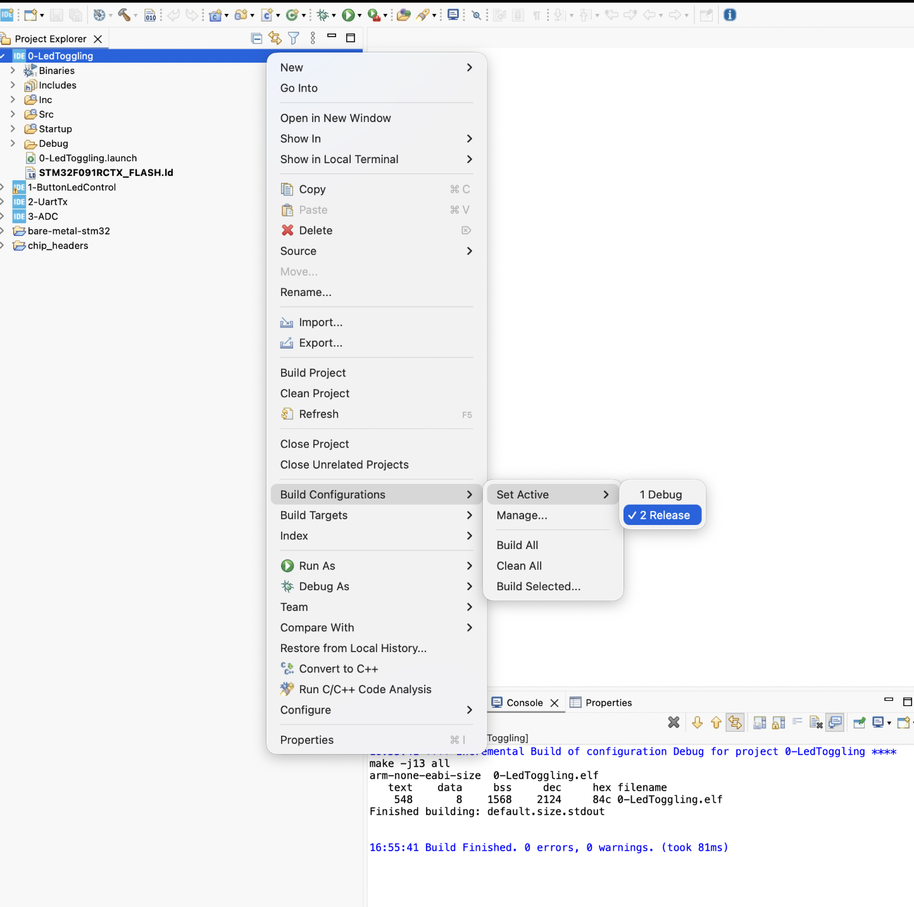
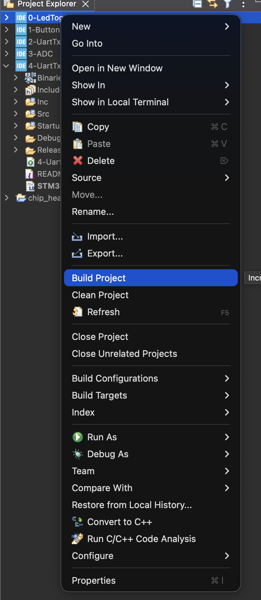
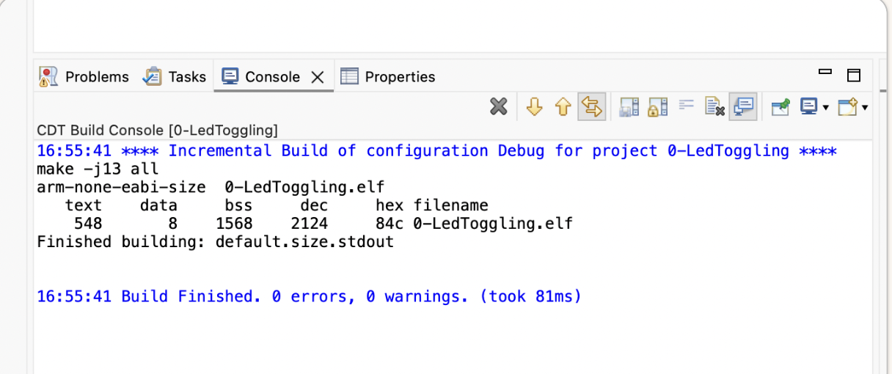
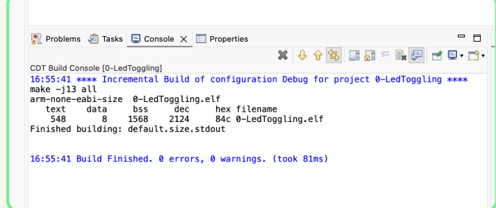
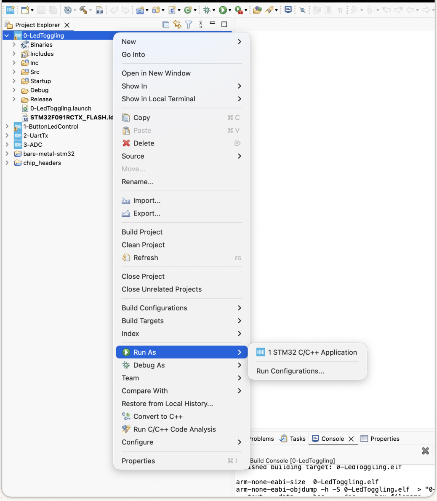
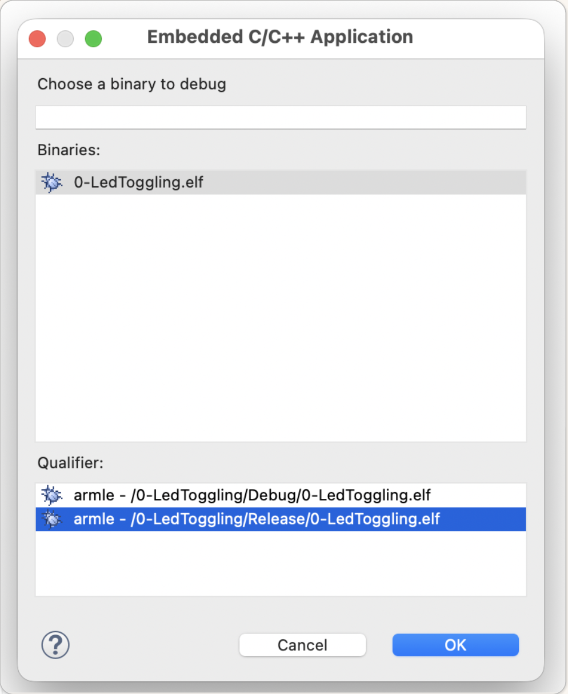
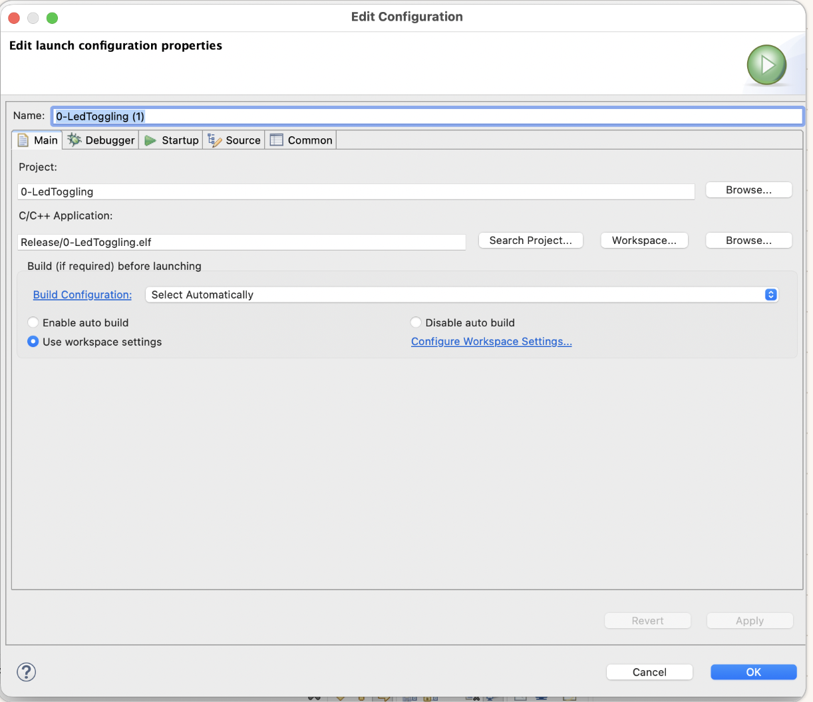

# STM32 Bare-Metal Projects for STM32CubeIDE 2.2.0

This repository contains focused bare-metal examples for the STM32F091RC / NUCLEO-F091RC board. Each project demonstrates one peripheral concept using direct register programming, CMSIS headers, and STM32CubeIDE project metadata.

## Target Platform

```console
Board:      NUCLEO-F091RC
MCU:        STM32F091RCTx
Core:       Arm Cortex-M0
IDE:        STM32CubeIDE 2.2.0
Toolchain:  GNU Tools for STM32
Debugger:   ST-LINK over SWD
Style:      Bare-metal register programming
```

## Repository Layout

```console
.
├── 0-LedToggling/
├── 1-ButtonLedControl/
├── 2-UartTx/
├── 3-ADC/
├── 4-UartTxRx/
├── chip_headers/
├── docs/
│   ├── images/
│   └── tools/
├── index.html
├── documentation.html
└── README.md
```

`chip_headers` contains the CMSIS core and STM32F0 device headers required by projects that include `stm32f0xx.h`.

## Peripheral Guides

<!-- MODULE_INDEX_START -->
| Project | Peripheral | What It Demonstrates | README | HTML Guide |
| --- | --- | --- | --- | --- |
| `0-LedToggling` | GPIO output | Enable GPIOA and toggle PA5 / LD2 | [README](0-LedToggling/README.md) | [HTML](0-LedToggling/index.html) |
| `1-ButtonLedControl` | GPIO input/output | Read PC13 user button and drive PA5 LED | [README](1-ButtonLedControl/README.md) | [HTML](1-ButtonLedControl/index.html) |
| `2-UartTx` | USART2 transmit | Send ASCII `A` on PA2 at 9600 baud | [README](2-UartTx/README.md) | [HTML](2-UartTx/index.html) |
| `3-ADC` | ADC1 | Read internal temperature sensor channel 16 | [README](3-ADC/README.md) | [HTML](3-ADC/index.html) |
| `4-UartTxRx` | USART2 transmit/receive | Receive terminal text on PA3 and echo it on PA2 | [README](4-UartTxRx/README.md) | [HTML](4-UartTxRx/index.html) |
<!-- MODULE_INDEX_END -->

Each peripheral README includes:

```console
Purpose and hardware behavior
STM32CubeIDE import/configuration steps
Required include paths and symbols
Build, flash, and test procedure
Register-level code walkthrough
Troubleshooting notes
Screenshot placeholders under docs/images
```

The browser-friendly documentation entry points are:

[index.html](index.html) for clean GitHub Pages hosting, and [documentation.html](documentation.html) as an explicit local documentation file.

## Adding A New Peripheral Project

When a new peripheral/module project is added, create its local `README.md`, then regenerate the module HTML pages and root indexes:

```console
node docs/tools/generate-module-html.mjs
```

The generator scans numeric project folders such as `5-SpiTx/`, creates or refreshes `index.html` and `documentation.html` beside each module README, updates the root Peripheral Guides table, updates the main [documentation.html](documentation.html) project cards, and refreshes the root [index.html](index.html) for GitHub Pages.

## Troubleshooting History

The full warning/error log with root causes and fixes is documented here:

[docs/troubleshooting-and-warnings.md](docs/troubleshooting-and-warnings.md)

## Import Old Projects Into STM32CubeIDE 2.2.0

Use this flow when importing older STM32CubeIDE projects, for example projects created with STM32CubeIDE v1.13 and opened later in STM32CubeIDE v2.2.0.

Important workspace rule:

```console
Use a separate STM32CubeIDE workspace folder.
Do not use the Git repository root as the workspace itself.
```

### Step 1: Open The Import Menu

From the top menu:

```console
File > Import...
```


### Step 2: Select Existing Eclipse Projects

In the Import dialog, choose:

```console
General > Existing Projects into Workspace
```

Then press:

```console
Next
```


### Step 3: Browse To The Old Project Repository Root

Choose:

```console
Select root directory
Browse...
```

Then select the folder that contains the project folders, for example:

```console
bare-metal-stm32/
```


### Step 4: Select Projects To Import

Enable:

```console
Search for nested projects
Copy projects into workspace
```

Select the firmware projects and the shared header project:

```console
0-LedToggling
1-ButtonLedControl
2-UartTx
3-ADC
4-UartTxRx
chip_headers
```

Then press:

```console
Finish
```


### Step 5: If CubeIDE Says Projects Already Exist

If the Import dialog says:

```console
Some projects cannot be imported because they already exist in the workspace
```

then the project names are already present in the current workspace. You have three clean options:

```console
Use a fresh workspace
Delete the old project from the workspace without deleting files from disk
Uncheck projects that already exist and import only the missing ones
```


### Step 6: Confirm Project Explorer

After import, Project Explorer should show the project folders and `chip_headers`.


For this repository, `chip_headers` is important because projects using CMSIS include:

```c
#include "stm32f0xx.h"
```

## Required STM32CubeIDE Settings

For projects that include `stm32f0xx.h`, there are two places that look similar but do different jobs.

This is the typical symptom when the editor/indexer or compiler cannot resolve the CMSIS device header:


| STM32CubeIDE Page | Purpose | Affects Real Build? | Use It For |
| --- | --- | --- | --- |
| `C/C++ Build > Settings > Tool Settings > MCU/MPU GCC Compiler > Include paths` | Adds `-I` paths to the real compiler command | Yes | Fixing `#include "stm32f0xx.h"` and `core_cm0.h` build errors |
| `C/C++ Build > Settings > Tool Settings > MCU/MPU GCC Compiler > Preprocessor` | Adds `-D` symbols to the real compiler command | Yes | Selecting the correct STM32 device macro, especially `STM32F091xC` |
| `C/C++ General > Paths and Symbols > Includes` | Feeds the Eclipse editor/indexer | No, editor only | Autocomplete, navigation, and removing false red squiggles |
| `C/C++ General > Paths and Symbols > Symbols` | Feeds the Eclipse editor/indexer | No, editor only | Helping the editor understand active `#ifdef` paths |

Rule of thumb:

```console
C/C++ Build   = compiler/linker truth
C/C++ General = editor/indexer assistance
```

If the project does not build, fix `C/C++ Build` first.

### Real Compiler Include Paths

```console
Right-click project
Properties
C/C++ Build
Settings
Tool Settings
MCU/MPU GCC Compiler
Include paths
```

Use `Configuration: All configurations`, then add:

```console
../Inc
${workspace_loc:/chip_headers/CMSIS/Device/ST/STM32F0xx/Include}
${workspace_loc:/chip_headers/CMSIS/Include}
```


These paths make the compiler find:

```console
Project local headers: ../Inc
STM32F0 device header: chip_headers/CMSIS/Device/ST/STM32F0xx/Include/stm32f0xx.h
CMSIS core header:     chip_headers/CMSIS/Include/core_cm0.h
```

Important: if the screenshot or your project shows `${workspace_loc:/chip_headers/CMSIS/Device/ST/STM32F0xx}` without the final `/Include`, edit it. The actual compiler path must end at the folder that contains `stm32f0xx.h`.

### Real Compiler Preprocessor Symbols

Configure symbols here:

```console
Right-click project
Properties
C/C++ Build
Settings
Tool Settings
MCU/MPU GCC Compiler
Preprocessor
```

This screenshot shows the correct page, but it is still missing the critical CMSIS macro:


Add:

```console
STM32
STM32F0
STM32F091RCTx
STM32F091xC
NUCLEO_F091RC
```


The important CMSIS device-selection symbol is:

```console
STM32F091xC
```

Do not replace it with:

```console
STM32F091RC
```

`STM32F091RC` is not the macro checked by `stm32f0xx.h`.

### Optional Editor Indexer Include Paths

After the real build settings are correct, configure the editor/indexer:

```console
Right-click project
Properties
C/C++ General
Paths and Symbols
Includes
GNU C
```

Add the same include paths:

```console
../Inc
${workspace_loc:/chip_headers/CMSIS/Device/ST/STM32F0xx/Include}
${workspace_loc:/chip_headers/CMSIS/Include}
```


This page helps the editor recognize headers. It is useful, but it is not enough by itself. If the compiler still says `No such file or directory`, the missing path must be fixed under `C/C++ Build`.

### Optional Editor Indexer Symbols

For editor-only symbol awareness, use:

```console
Right-click project
Properties
C/C++ General
Paths and Symbols
Symbols
GNU C
```

Add at least:

```console
STM32F091xC
```

This screenshot shows the indexer symbols page. If `STM32F091xC` is missing, add it here too:


This makes the editor follow the same CMSIS device branch as the compiler.

### Correct Configuration Order

Use this order for old projects imported into STM32CubeIDE 2.2.0:

| Step | Page | Add |
| --- | --- | --- |
| 1 | `C/C++ Build > MCU/MPU GCC Compiler > Include paths` | `../Inc`, CMSIS device include path, CMSIS core include path |
| 2 | `C/C++ Build > MCU/MPU GCC Compiler > Preprocessor` | `STM32F091xC` and project symbols |
| 3 | `C/C++ General > Paths and Symbols > Includes` | Same include paths, for editor only |
| 4 | `C/C++ General > Paths and Symbols > Symbols` | Same key device symbol, for editor only |
| 5 | `Project > Clean...` | Clean generated objects |
| 6 | `Build Project` | Rebuild with corrected settings |

## Build And Flash

After changing include paths or symbols:

```console
Project > Clean...
Right-click project > Build Project
Right-click project > Debug As > STM32 Cortex-M C/C++ Application
```

### 1. Select The Active Build Configuration

Right-click the project you want to build, then choose:

```console
Build Configurations > Set Active > Debug
```

or:

```console
Build Configurations > Set Active > Release
```



The active configuration decides which output folder and ELF file CubeIDE generates:

```console
Debug/<project-name>.elf
Release/<project-name>.elf
```

### 2. Build Only The Selected Project

Right-click the project and choose:

```console
Build Project
```



You can also use the toolbar hammer button, but make sure the intended project/configuration is active first:


The expected result is:

```console
Build Finished. 0 errors, 0 warnings.
```



Final clean build proof:



### 3. Run Or Debug The Correct ELF

Right-click the project and choose:

```console
Run As > STM32 C/C++ Application
```

or:

```console
Debug As > STM32 Cortex-M C/C++ Application
```



If CubeIDE asks which binary to debug, choose the ELF that matches the active configuration you built:

```console
Debug/<project-name>.elf
Release/<project-name>.elf
```



If you need to edit the launch configuration manually, set:

```console
Project:             <project-name>
C/C++ Application:   Release/<project-name>.elf
Build Configuration: Select Automatically
```



Recommended debug settings:

```console
Application: Debug/<project-name>.elf
Interface:   SWD
Reset mode:  Connect under reset
SWV:         Disabled
```


### 4. If Flashing Fails Before Download

If CubeIDE shows:

```console
Error in final launch sequence:
Failed to start GDB server
```

it got past "which ELF should I flash?" and failed before programming the target.


Check the console details. This message points to an ST-LINK connection problem, not a C build problem:

```console
libusb: info [darwin_claim_interface] no interface found
Error in initializing ST-LINK device.
Reason: Failed to connect to device.
Please check power and cabling to target.
```


On macOS, allow the ST-LINK accessory when the system asks:


Then unplug and reconnect the board, use a known data USB cable, avoid USB hubs during debug, and retry. If the probe is detected but firmware is old or unknown, open the ST-LINK firmware updater and update the probe firmware.


## Documentation Images

All screenshots and hardware captures are expected under:

```console
docs/images
```

The Markdown image links are intentionally kept even when a file is not present yet. Add future screenshots using the same filenames to complete the visual documentation.

## Repository Hygiene

Commit source, project metadata, linker scripts, startup files, CMSIS headers, README files, and documentation images.

Do not commit generated workspace or build output:

```console
.metadata/
Debug/
Release/
*.o
*.elf
*.hex
*.bin
*.map
*.list
*.d
*.su
*.cyclo
```

The repository `.gitignore` is configured for this STM32CubeIDE workflow.
