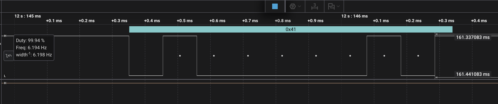

# STM32 Bare-Metal Projects for STM32CubeIDE 2.2.0

This repository contains small, focused bare-metal projects for the STM32F091RC / NUCLEO-F091RC board. Each project demonstrates one hardware concept using direct register programming instead of HAL or CubeMX-generated application code.

The repository is organized for learning and debugging at the hardware level: GPIO output, GPIO input, USART transmit, and ADC conversion.

## Target Platform

```console
Board:      NUCLEO-F091RC
MCU:        STM32F091RCTx
Core:       Arm Cortex-M0
IDE:        STM32CubeIDE 2.2.0
Toolchain:  GNU Tools for STM32
Debugger:   ST-LINK over SWD
Style:      Bare-metal register programming
```

## Repository Layout

```console
.
├── 0-LedToggling/
├── 1-ButtonLedControl/
├── 2-UartTx/
├── 3-ADC/
├── chip_headers/
├── docs/
│   └── images/
└── README.md
```

`chip_headers` contains CMSIS headers used by projects that include `stm32f0xx.h`.

## Projects

| Project | Peripheral | Main Idea | Expected Hardware Result |
| --- | --- | --- | --- |
| `0-LedToggling` | GPIO output | Enable GPIOA and toggle PA5 | LD2/user LED blinks |
| `1-ButtonLedControl` | GPIO input/output | Read PC13 button and drive PA5 LED | Button press controls LED |
| `2-UartTx` | USART2 TX | Send ASCII `A` repeatedly on PA2 | Terminal receives `A`; analyzer decodes `0x41` |
| `3-ADC` | ADC1 | Read internal temperature sensor channel | ADC conversion completes in firmware |

## Image Placeholder Convention

All documentation images are expected under:

```console
docs/images
```

If an image does not exist yet, keep the Markdown placeholder and later add a PNG with the same filename.

Example:

```markdown

```

## STM32CubeIDE Import Flow

Use an external workspace folder, not the repository root.

Recommended workspace example:

```console
<external-workspace-folder>
```

Import the projects:

```console
File > Import... > General > Existing Projects into Workspace
```


Select this repository root:

```console
<repo-root>
```


Import:

```console
0-LedToggling
1-ButtonLedControl
2-UartTx
3-ADC
chip_headers
```


## Required Compiler Include Paths

The real build settings are under `C/C++ Build`. Configure this first.

Open each project:

```console
Right-click project
Properties
C/C++ Build
Settings
Tool Settings
MCU/MPU GCC Compiler
Include paths
```


Set:

```console
Configuration: All configurations
```


Recommended include paths:

```console
../Inc
${workspace_loc:/chip_headers/CMSIS/Device/ST/STM32F0xx/Include}
${workspace_loc:/chip_headers/CMSIS/Include}
```


Important:

```console
Wrong: ${workspace_loc:/chip_headers/CMSIS/Device/ST/STM32F0xx}
Right: ${workspace_loc:/chip_headers/CMSIS/Device/ST/STM32F0xx/Include}
```

The final `/Include` is required because `stm32f0xx.h` is inside that folder.

## Required Compiler Symbols

Open:

```console
Right-click project
Properties
C/C++ Build
Settings
Tool Settings
MCU/MPU GCC Compiler
Preprocessor
```


Set:

```console
Configuration: All configurations
```

Add:

```console
STM32
STM32F0
STM32F091RCTx
STM32F091xC
```

For Nucleo-board examples, also keep:

```console
NUCLEO_F091RC
```


`STM32F091xC` is the important CMSIS device macro. `STM32F091RC` is not the macro used by `stm32f0xx.h`.

## Optional Editor Indexer Settings

These settings help autocomplete and red squiggles. They do not replace compiler settings.

Open:

```console
Right-click project
Properties
C/C++ General
Paths and Symbols
Includes
GNU C
```


Add the same include paths:

```console
../Inc
${workspace_loc:/chip_headers/CMSIS/Device/ST/STM32F0xx/Include}
${workspace_loc:/chip_headers/CMSIS/Include}
```

Then:

```console
C/C++ General > Paths and Symbols > Symbols > GNU C
```


Add:

```console
STM32F091xC
```

Rule of thumb:

```console
C/C++ Build   = real compiler and linker
C/C++ General = editor/indexer only
```

## Clean, Build, Flash

After changing paths or symbols:

```console
Project > Clean...
```


Build:

```console
Right-click project > Build Project
```


Use Debug first while validating hardware:

```console
Right-click project
Build Configurations > Set Active > Debug
```


Flash/debug:

```console
Right-click project
Debug As > STM32 Cortex-M C/C++ Application
```


Recommended debug settings:

```console
Application: Debug/<project-name>.elf
Interface:   SWD
Reset mode:  Connect under reset
SWV:         Disabled
```


## Peripheral Notes

### 0-LedToggling - GPIO Output

Purpose: configure PA5 as a general-purpose output and toggle it forever.

Main register sequence:

```c
RCC->AHBENR |= GPIOAEN;

GPIOA->MODER |=  (1U << 10);
GPIOA->MODER &= ~(1U << 11);

while (1)
{
    GPIOA->ODR ^= LED_PIN_NUM;
    for (int i = 0; i < 500000; i++);
}
```

What to verify:

```console
PA5/LD2 toggles
GPIOA clock is enabled before accessing GPIOA registers
PA5 MODER bits are 01 for output mode
```


### 1-ButtonLedControl - GPIO Input And Output

Purpose: configure PA5 as output and PC13 as input. The user button is active-low.

Main register sequence:

```c
RCC->AHBENR |= GPIOAEN;
RCC->AHBENR |= GPIOCEN;

GPIOA->MODER &= ~(3U << (2 * LED_PIN));
GPIOA->MODER |=  (1U << (2 * LED_PIN));

GPIOC->MODER &= ~(3U << (2 * BTN_PIN));

if (!(GPIOC->IDR & BTN_MASK)) {
    GPIOA->BSRR = LED_ON;
} else {
    GPIOA->BSRR = LED_OFF;
}
```

What to verify:

```console
PA5 changes state when PC13 user button is pressed
PC13 reads high when released and low when pressed
BSRR lower half sets PA5; upper half resets PA5
```


### 2-UartTx - USART2 Transmit

Purpose: configure USART2 on PA2/PA3 and repeatedly transmit ASCII `A`.

Target UART setup:

```console
USART: USART2
TX:    PA2
RX:    PA3
Baud:  9600
Frame: 8N1
Logic: 3.3 V idle-high, non-inverted
```

Initialization sequence:

```c
RCC->AHBENR |= GPIOAEN;

GPIOA->MODER &= ~((1U<<4) | (1U<<6));
GPIOA->MODER |=  ((1U<<5) | (1U<<7));

GPIOA->AFR[0] &= ~((0xF << 8) | (0xF << 12));
GPIOA->AFR[0] |=  ((1 << 8) | (1 << 12));

RCC->APB1ENR |= UART2EN;

USART2->CR1 &= ~USART_CR1_UE;
USART2->BRR = compute_uart_bd(APB1_CLK, UART_BAUDRATE);
USART2->CR1 = USART_CR1_TE | USART_CR1_RE;
USART2->CR1 |= USART_CR1_UE;
```

Transmit loop:

```c
while (!(USART2->ISR & USART_ISR_TXE)) {}
USART2->TDR = 'A';
```

Test with terminal:

```bash
/bin/ls /dev/cu.usbmodem*
screen /dev/cu.usbmodem212403 9600
```

Expected terminal output:

```console
AAAAAAAAAAAAAAAA
```

Test with logic analyzer:

```console
Analyzer:    Async Serial
Baud:        9600
Data bits:   8
Parity:      None
Stop bits:   1
Signal:      Non-inverted
Bit order:   LSB first
Sample rate: 1 MS/s minimum, 5-10 MS/s recommended
```

ASCII `A` frame:

```console
0x41 = 0100 0001

Start  b0 b1 b2 b3 b4 b5 b6 b7  Stop
  0     1  0  0  0  0  0  1  0    1
```

At 9600 baud:

```console
Bit time:   104.16 us
Frame time: about 1.04 ms
```




### 3-ADC - ADC1 Internal Temperature Read

Purpose: configure ADC1 and start conversions on the internal temperature sensor channel.

Initialization sequence:

```c
RCC->AHBENR |= RCC_AHBENR_GPIOAEN;
GPIOA->MODER |= GPIO_MODER_MODER1;

RCC->APB2ENR |= RCC_APB2ENR_ADC1EN;

ADC->CCR |= ADC_CCR_TSEN | ADC_CCR_VREFEN;

ADC1->CR |= ADC_CR_ADCAL;
while (ADC1->CR & ADC_CR_ADCAL);

ADC1->CFGR1 &= ~ADC_CFGR1_RES;
ADC1->CFGR1 &= ~ADC_CFGR1_ALIGN;

ADC1->CHSELR = ADC_CHSELR_CHSEL16;

ADC1->CR |= ADC_CR_ADEN;
while (!(ADC1->ISR & ADC_ISR_ADRDY));
```

Read sequence:

```c
ADC1->CR |= ADC_CR_ADSTART;
while (!(ADC1->ISR & ADC_ISR_EOC));
uint16_t adc_value = ADC1->DR;
```

Current temperature calculation:

```c
temp_celsius = ((adc_value * 3.3 / 4095.0) - 1.43) / 0.0043 + 25;
```

Professional note: this project currently calculates `temp_celsius` as a local variable and does not expose it. For debugger validation, make it `volatile` or global if you want to watch it in CubeIDE live expressions.

```c
volatile float temp_celsius;
```


## Common Errors And Fixes

### `fatal error: stm32f0xx.h: No such file or directory`

Cause: missing CMSIS device include path.

Fix:

```console
${workspace_loc:/chip_headers/CMSIS/Device/ST/STM32F0xx/Include}
```

### `fatal error: core_cm0.h: No such file or directory`

Cause: missing CMSIS core include path.

Fix:

```console
${workspace_loc:/chip_headers/CMSIS/Include}
```

### `Please select first the target STM32F0xx device`

Cause: missing CMSIS device macro.

Fix:

```console
STM32F091xC
```

### `_read`, `_write`, `_close`, Or `_lseek` Warnings

These are normal bare-metal/newlib warnings when using `nosys.specs`. If the build ends with an `.elf`, the firmware built successfully.

### `No ST-LINK detected`

Check STM32CubeProgrammer first. CubeIDE cannot flash if CubeProgrammer cannot detect the probe.

Check:

```console
USB data cable
ST-LINK USB port
Board power LED
Direct USB connection instead of hub
ST-LINK server installed
macOS Privacy & Security approval if prompted
```

## Repository Hygiene

Commit source and project metadata:

```console
README.md
chip_headers/
0-LedToggling/.project
0-LedToggling/.cproject
0-LedToggling/Inc/
0-LedToggling/Src/
0-LedToggling/Startup/
0-LedToggling/*.ld
```

Do not commit workspace metadata or build outputs:

```console
.metadata/
Debug/
Release/
*.o
*.elf
*.map
*.list
*.d
*.su
*.cyclo
```

The nested `bare-metal-stm32/` directory appears to be an older copied repository. Keep it out of the new repo unless you intentionally want a vendored copy.

## Code Review Notes

These projects are good learning examples, but a few implementation details matter when moving from Debug experiments to reliable firmware.

### LED delay loop

`0-LedToggling` uses an empty delay loop:

```c
for (int i = 0; i < 500000; i++);
```

In Release builds, an optimizer may remove or shorten this loop because `i` is not `volatile` and the loop has no visible side effect. For a simple learning delay, prefer:

```c
for (volatile int i = 0; i < 500000; i++);
```

For production firmware, prefer a timer-based delay.

### Button input polarity

`1-ButtonLedControl` treats PC13 as active-low:

```c
if (!(GPIOC->IDR & BTN_MASK)) {
    GPIOA->BSRR = LED_ON;
}
```

That matches the usual Nucleo user-button behavior. If porting to another board, confirm whether the button has pull-up or pull-down wiring.

### UART transmit-only behavior

`2-UartTx` enables both transmitter and receiver:

```c
USART2->CR1 = USART_CR1_TE | USART_CR1_RE;
```

The current application only transmits. Enabling RX is harmless, but later receive examples should also check RXNE/RXFNE flags and read `USART2->RDR`.

### ADC function naming and observability

`3-ADC` has a function named `pa1_adc_init()`, but the code selects the internal temperature sensor:

```c
ADC1->CHSELR = ADC_CHSELR_CHSEL16;
```

That name should eventually become something like:

```c
adc_internal_temperature_init()
```

Also, `temp_celsius` is currently local:

```c
float temp_celsius = 0.0;
```

If the goal is to inspect the value in CubeIDE while debugging, make it global and `volatile`:

```c
volatile float temp_celsius;
```

### ADC calibration

The current temperature formula uses typical voltage and slope values:

```c
temp_celsius = ((adc_value * 3.3 / 4095.0) - 1.43) / 0.0043 + 25;
```

For more accurate readings, use the factory calibration constants from the STM32 system memory instead of typical datasheet values.

## Final Validation Checklist

```console
[ ] Import `chip_headers`
[ ] Import each lesson project
[ ] Set compiler include paths under C/C++ Build
[ ] Define STM32F091xC under compiler preprocessor symbols
[ ] Clean and rebuild Debug
[ ] Flash with ST-LINK over SWD
[ ] Validate output on real hardware
[ ] Add screenshots under docs/images
```
