# Troubleshooting And Warning History

This document records the build, flash, and hardware-debug issues seen while preparing these STM32CubeIDE 2.2.0 bare-metal projects. Each section explains what the message means, why it happened, and how it was fixed.

## 1. `stm32f0xx.h: No such file or directory`

### Symptom

```console
fatal error: stm32f0xx.h: No such file or directory
    1 | #include "stm32f0xx.h"
```

### Meaning

The compiler could not find the STM32F0 CMSIS device header.

### Root Cause

The include path was either missing or pointed one folder too high.

Wrong:

```console
${workspace_loc:/chip_headers/CMSIS/Device/ST/STM32F0xx}
```

Right:

```console
${workspace_loc:/chip_headers/CMSIS/Device/ST/STM32F0xx/Include}
```

The final `/Include` is required because `stm32f0xx.h` is inside that directory.

### Fix

Set the real compiler include paths under:

```console
Right-click project
Properties
C/C++ Build
Settings
Tool Settings
MCU/MPU GCC Compiler
Include paths
```

Add:

```console
../Inc
${workspace_loc:/chip_headers/CMSIS/Device/ST/STM32F0xx/Include}
${workspace_loc:/chip_headers/CMSIS/Include}
```

### Important Note

`C/C++ General > Paths and Symbols` is mostly for the editor/indexer. It helps autocomplete and red squiggles, but it does not replace the real build settings under `C/C++ Build`.

## 1B. STM32CubeIDE Header Path Configuration: Build vs General

STM32CubeIDE has two similar-looking places for include paths and symbols. They do not do the same job.

This is the common header-resolution symptom:

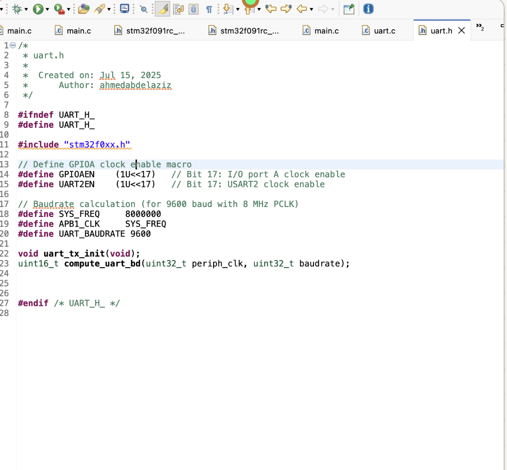

| IDE Page | What It Controls | Affects Build? | Use It For |
| --- | --- | --- | --- |
| `C/C++ Build > Settings > Tool Settings > MCU/MPU GCC Compiler > Include paths` | Adds `-I` include folders to the real compiler command | Yes | Fixing `fatal error: stm32f0xx.h: No such file or directory` |
| `C/C++ Build > Settings > Tool Settings > MCU/MPU GCC Compiler > Preprocessor` | Adds `-D` macros to the real compiler command | Yes | Selecting the STM32 device macro such as `STM32F091xC` |
| `C/C++ General > Paths and Symbols > Includes` | Feeds the Eclipse CDT indexer | No | Autocomplete, code navigation, and false editor errors |
| `C/C++ General > Paths and Symbols > Symbols` | Feeds the Eclipse CDT indexer | No | Helping the editor understand active `#ifdef` blocks |

The short rule is:

```console
C/C++ Build   = compiler truth
C/C++ General = editor/indexer view
```

If the project does not build, fix `C/C++ Build` first. After the build is correct, mirror the same paths and symbols in `C/C++ General` so the editor also looks clean.

### Real Compiler Include Paths

Use this page for actual build include paths:

```console
Right-click project
Properties
C/C++ Build
Settings
Tool Settings
MCU/MPU GCC Compiler
Include paths
```

Add:

```console
../Inc
${workspace_loc:/chip_headers/CMSIS/Device/ST/STM32F0xx/Include}
${workspace_loc:/chip_headers/CMSIS/Include}
```

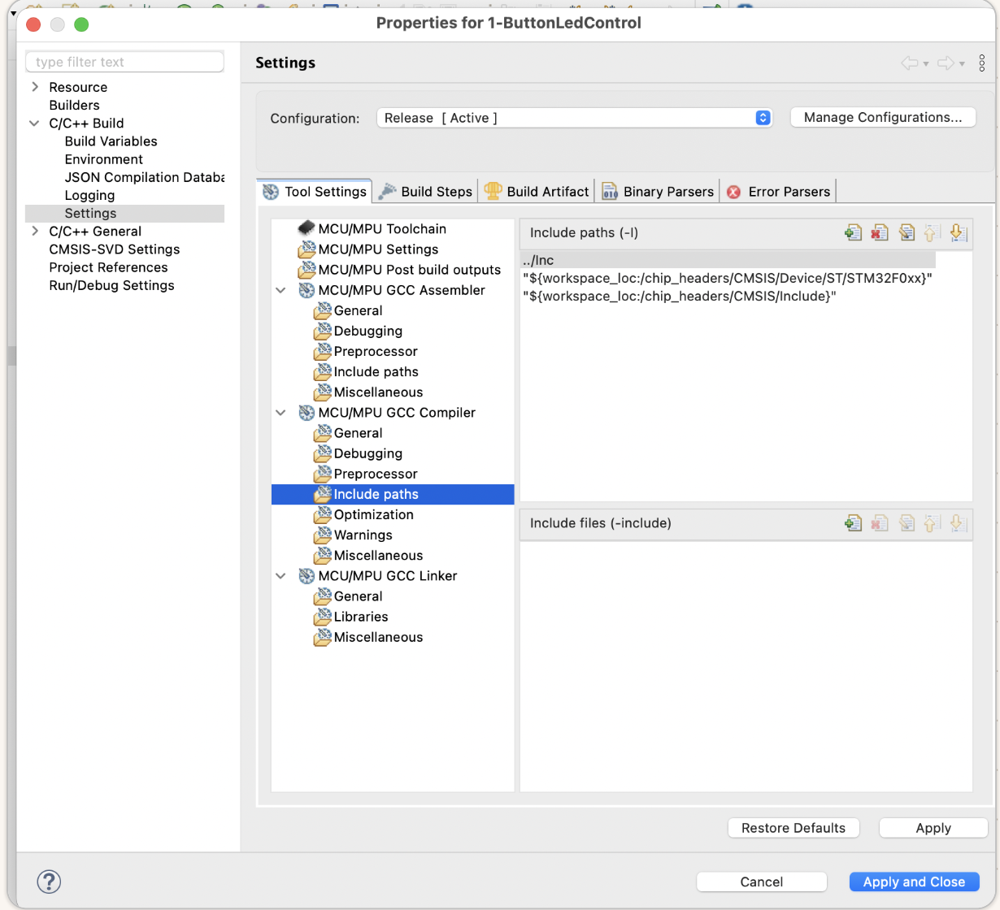

This is the setting that must be correct before `#include "stm32f0xx.h"` can compile.

Important: the compiler path for the STM32F0 device header must end with `/Include`. If it stops at `STM32F0xx`, the compiler is still one folder too high.

### Real Compiler Preprocessor Symbols

Use this page for actual compiler `-D` symbols:

```console
Right-click project
Properties
C/C++ Build
Settings
Tool Settings
MCU/MPU GCC Compiler
Preprocessor
Define symbols (-D)
```

This screenshot shows the correct page, but the build still needs the CMSIS macro `STM32F091xC`:

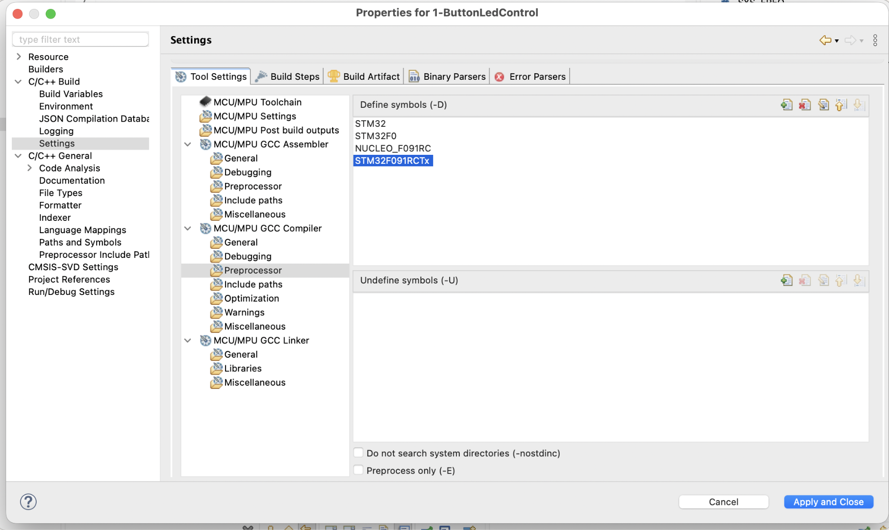

Add:

```console
STM32
STM32F0
STM32F091RCTx
STM32F091xC
NUCLEO_F091RC
```

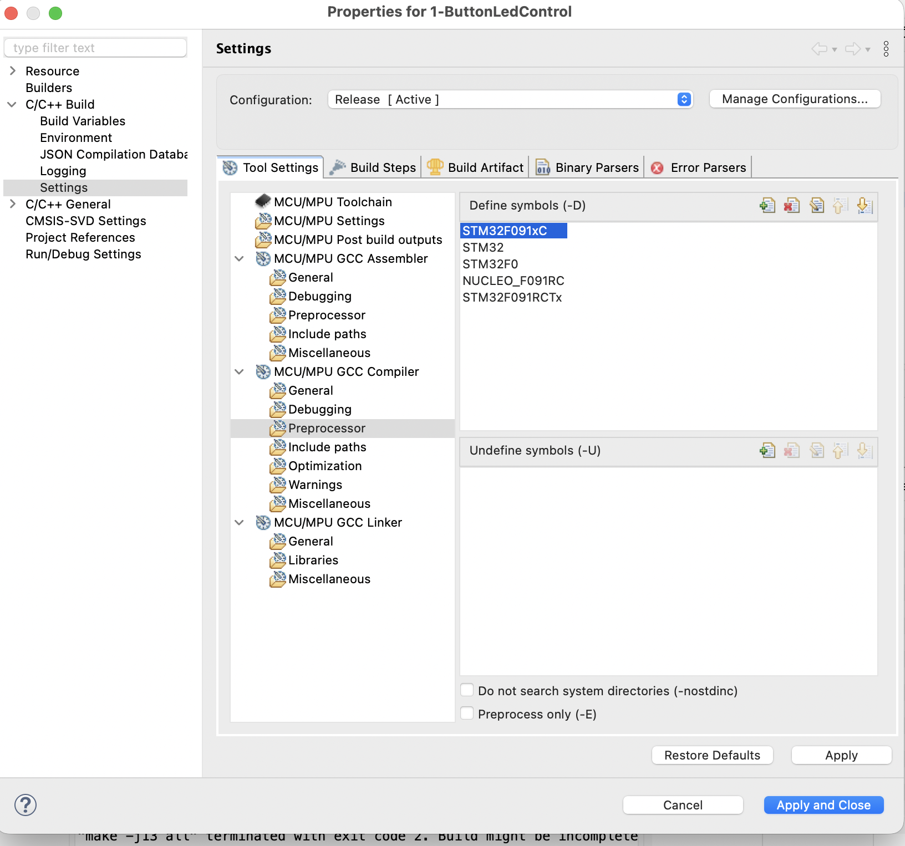

The critical CMSIS device-selection symbol is `STM32F091xC`.

### Editor Indexer Include Paths

Use this page only after the real build settings are correct:

```console
Right-click project
Properties
C/C++ General
Paths and Symbols
Includes
GNU C
```

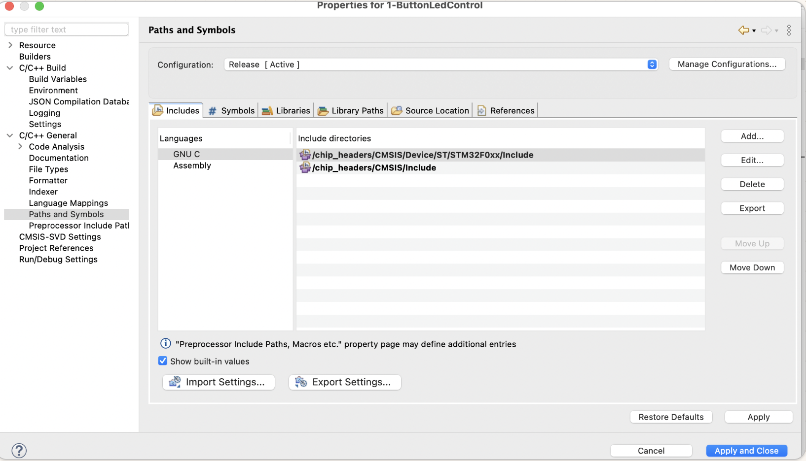

Add the same include folders used by the compiler:

```console
../Inc
${workspace_loc:/chip_headers/CMSIS/Device/ST/STM32F0xx/Include}
${workspace_loc:/chip_headers/CMSIS/Include}
```

This page helps the editor find headers. It does not repair a failed `arm-none-eabi-gcc` command if the compiler include paths are missing.

### Editor Indexer Symbols

For clean editor parsing, also mirror the important symbols here:

```console
Right-click project
Properties
C/C++ General
Paths and Symbols
Symbols
GNU C
```

Add at least:

```console
STM32F091xC
```

This screenshot shows the indexer symbols page. If `STM32F091xC` is missing, add it here too:

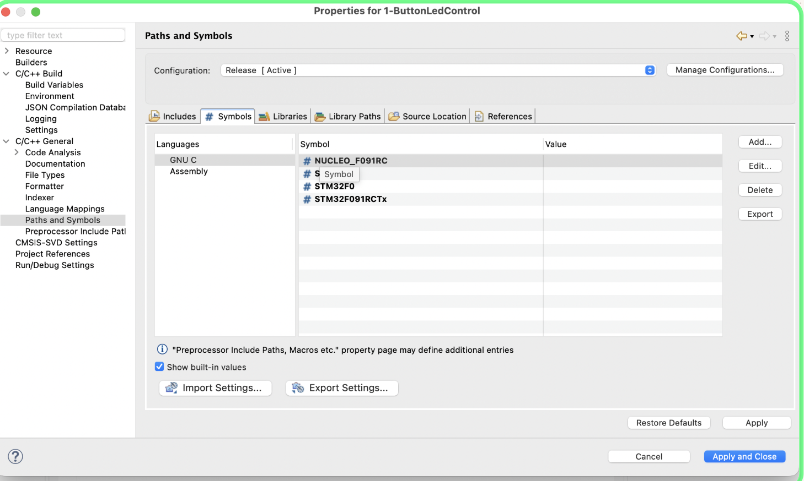

You may also mirror `STM32`, `STM32F0`, `STM32F091RCTx`, and `NUCLEO_F091RC` for consistency.

### Correct Order To Fix Header Problems

| Order | Where | What To Set |
| --- | --- | --- |
| 1 | `C/C++ Build > MCU/MPU GCC Compiler > Include paths` | `../Inc`, CMSIS device include path, CMSIS core include path |
| 2 | `C/C++ Build > MCU/MPU GCC Compiler > Preprocessor` | `STM32F091xC` and project symbols |
| 3 | `Project > Clean...` | Clean the active configuration |
| 4 | Build project | Confirm the compiler command succeeds |
| 5 | `C/C++ General > Paths and Symbols` | Mirror paths and symbols for the editor |

## 1A. Importing Old STM32CubeIDE Projects Into v2.2.0

### Symptom

Older projects created in STM32CubeIDE v1.13 need to be opened in STM32CubeIDE v2.2.0.

### Correct Import Flow

Use:

```console
File > Import...
General > Existing Projects into Workspace
```

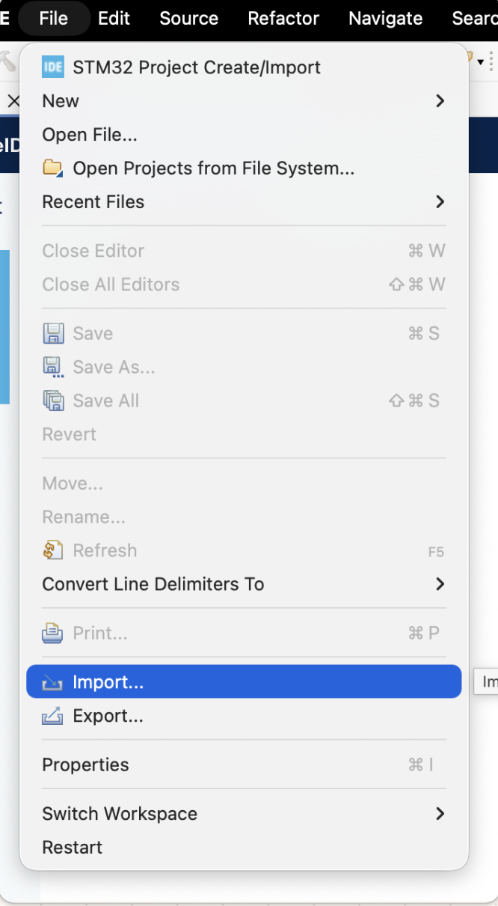

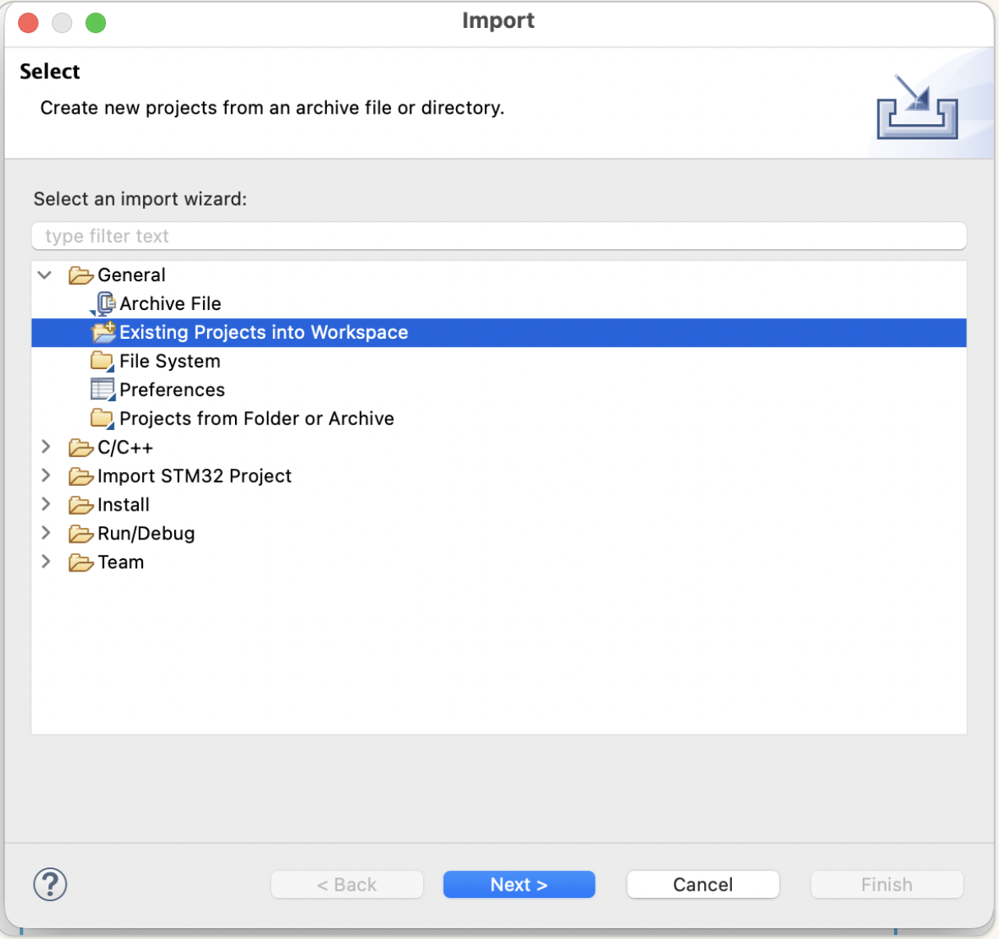

Select the repository root that contains the old projects:

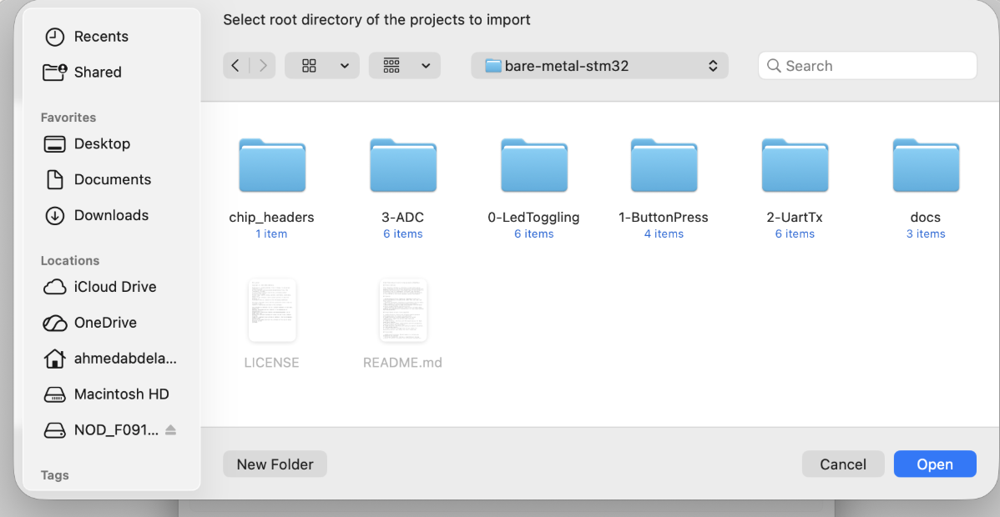

Enable:

```console
Search for nested projects
Copy projects into workspace
```

Then select the projects and `chip_headers`:

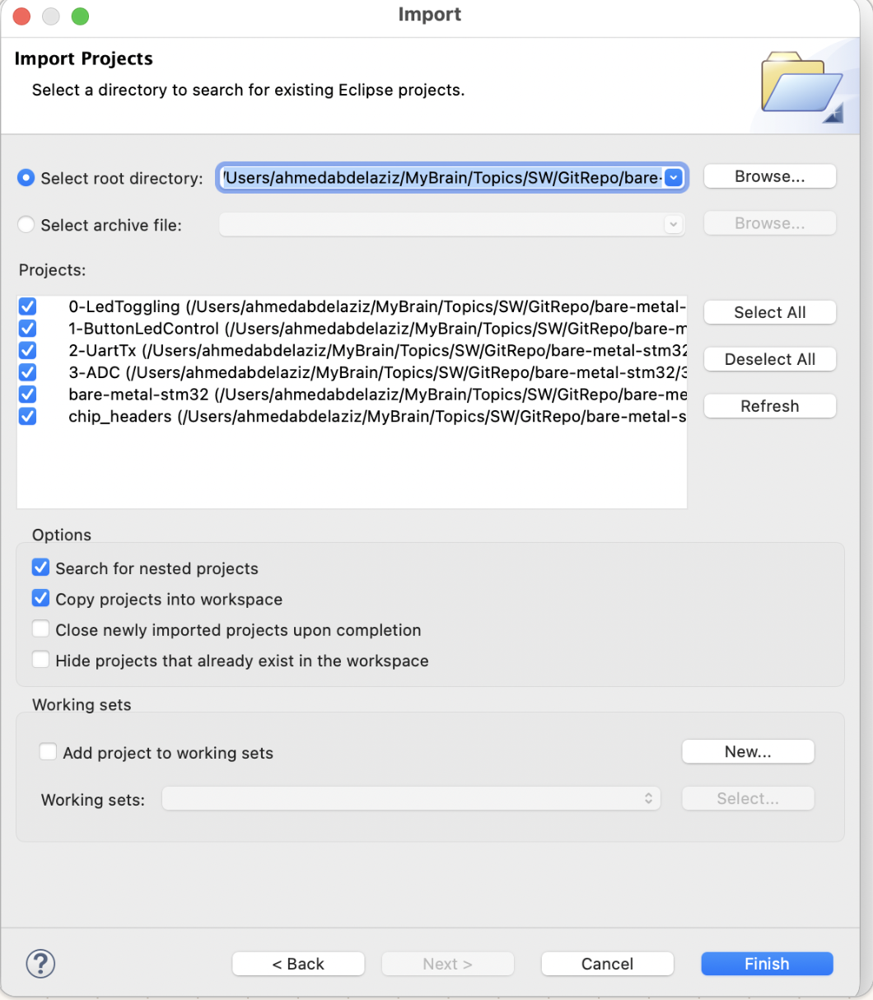

After import, Project Explorer should show the imported projects:

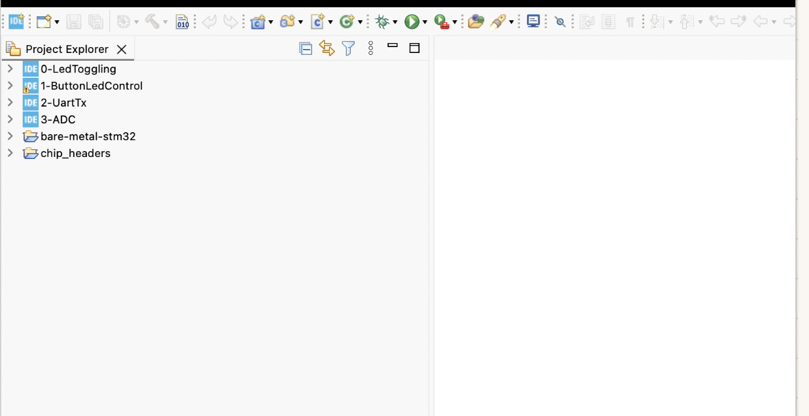

### Already Exists Warning

If CubeIDE shows:

```console
Some projects cannot be imported because they already exist in the workspace
```

it means the current workspace already has projects with the same Eclipse project names.

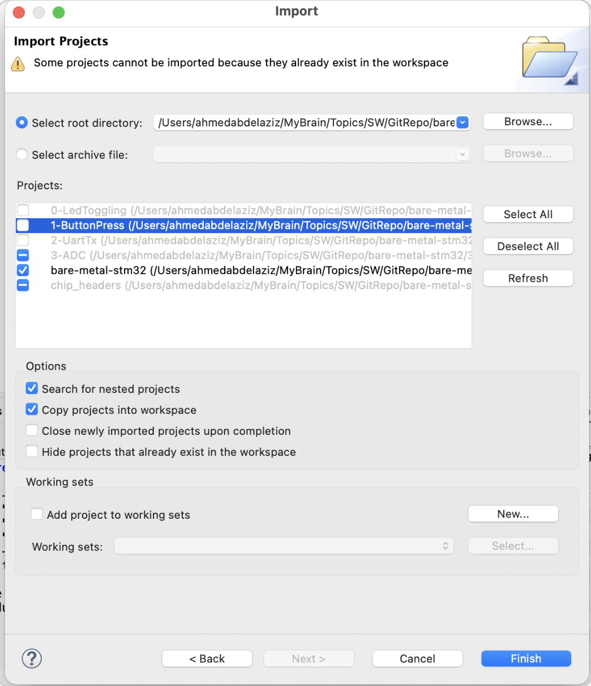

Fix options:

```console
Use a fresh workspace
Delete the old project from the workspace without deleting files from disk
Uncheck projects that already exist and import only missing projects
```

## 2. Device Selection Error From `stm32f0xx.h`

### Symptom

The build reaches `stm32f0xx.h`, then fails with a message asking to select the target STM32F0 device.

### Meaning

The CMSIS header was found, but it did not know which exact STM32F0 device header to include.

### Root Cause

The required CMSIS device macro was missing.

### Fix

Set compiler symbols under:

```console
Right-click project
Properties
C/C++ Build
Settings
Tool Settings
MCU/MPU GCC Compiler
Preprocessor
```

Add:

```console
STM32
STM32F0
STM32F091RCTx
STM32F091xC
NUCLEO_F091RC
```

The critical symbol is:

```console
STM32F091xC
```

### Why `STM32F091RC` Did Not Work

`STM32F091RC` is a marketing/package-style part name. The ST CMSIS header expects family macros like:

```console
STM32F091xC
```

`STM32F091RCTx` is the CubeIDE target name. `STM32F091xC` is the CMSIS device-selection macro.

## 3. `Failed to start GDB server`

### Symptom

```console
Error in final launch sequence:
Failed to start GDB server
```

### Meaning

CubeIDE could not start or connect to the ST-LINK GDB server.

This dialog means CubeIDE got past the project build and the "which ELF?" selection, then failed before flashing because the ST-LINK GDB server could not initialize the probe.

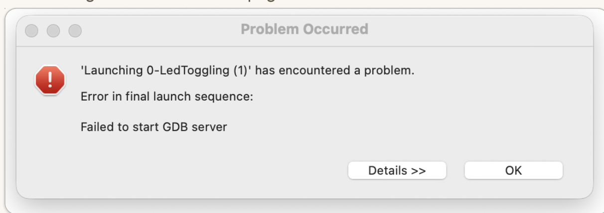

### Common Causes

```console
ST-LINK not detected
USB cable is power-only
Wrong debug probe/interface
ST-LINK server problem
Board not powered
Another debug session still using the probe
```

The console may show details like:

```console
libusb: info [darwin_claim_interface] no interface found; setting configuration: 1
Error in initializing ST-LINK device.
Reason: Failed to connect to device. Please check power and cabling to target.
libusb: error [darwin_claim_interface] could not set configuration
```

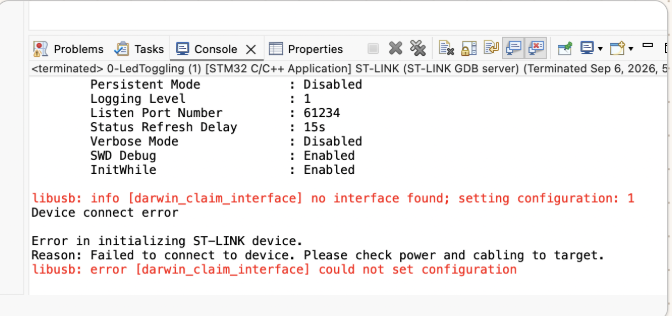

In this case, the bundled GDB server executable may be installed correctly, but macOS/CubeProgrammer still cannot see the ST-LINK probe. That separates the problem from compiler settings: the ELF was produced, but the probe connection failed.

### Fix

Verify ST-LINK detection first with STM32CubeProgrammer. CubeIDE cannot debug if CubeProgrammer cannot see the board.

Recommended debug settings:

```console
Interface:   SWD
Reset mode:  Connect under reset
SWV:         Disabled
```

Also check:

```console
Use the ST-LINK USB connector
Use a known data USB cable
Avoid USB hubs while debugging
Stop old debug sessions
Power-cycle the board
```

On macOS, approve the accessory prompt if it appears:

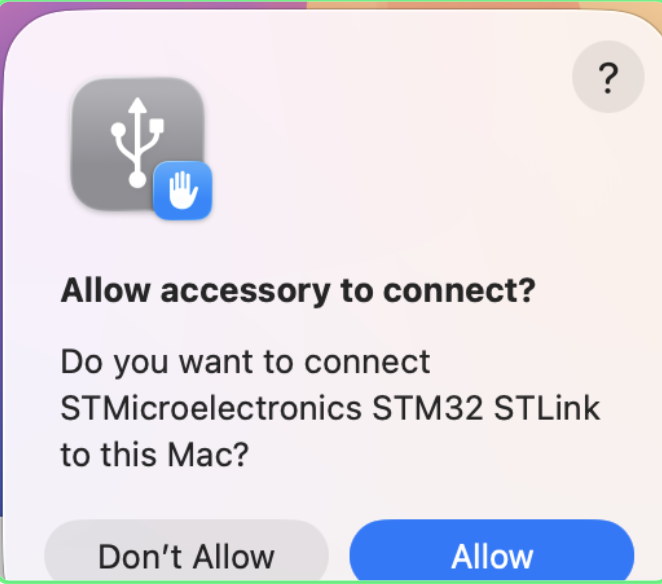

If the board appears after reconnecting but ST-LINK firmware is old or reported as unknown, open the ST-LINK firmware upgrade utility, refresh the device list, enter update mode if needed, and update the probe firmware:

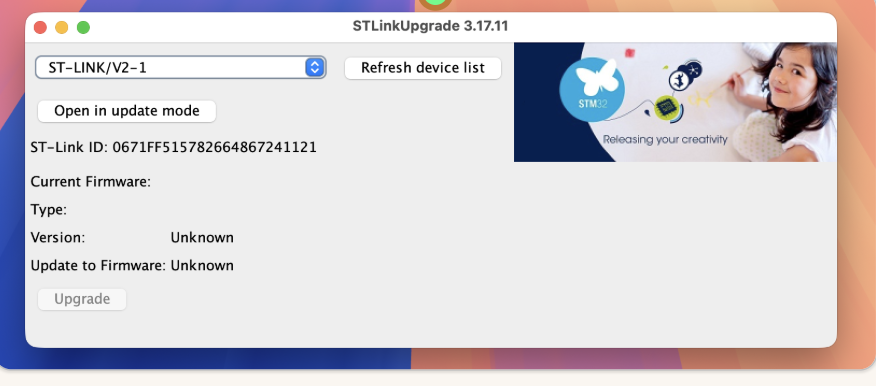

After the probe is detected again, rebuild the project and launch the matching ELF.

## 4. `No ST-LINK detected`

### Symptom

```console
No ST-LINK detected! Please connect ST-LINK and restart the debug session.
```

### Meaning

The host computer did not detect the ST-LINK debug probe.

### Fix

Check:

```console
USB data cable
Correct USB connector on the Nucleo board
Board power LED
macOS security prompt approval, if shown
STM32CubeProgrammer can connect over ST-LINK
```

After the ST-LINK is detected in STM32CubeProgrammer, retry the CubeIDE debug session.

## 5. UART TX Works In Terminal But Not On Expected Header Pin

### Symptom

The terminal receives `A`, but the logic analyzer does not show the signal on the expected board pin/header.

### Meaning

USART2 is transmitting, but the probe point may not be on the active routed signal.

### Root Cause

On the NUCLEO-F091RC, USART2 is commonly routed to the ST-LINK virtual COM port through solder bridges. With default board routing, PA2/PA3 can be connected to ST-LINK VCP rather than the Arduino header pins you expected.

### Fix

For UART TX on this project:

```console
USART2_TX = PA2
USART2_RX = PA3
Baud      = 9600
Frame     = 8N1
Logic     = 3.3 V, idle high, non-inverted
```

For logic analyzer:

```console
Analyzer GND -> Nucleo GND
Analyzer D0  -> PA2 / USART2_TX path
Analyzer D1  -> PA3 / USART2_RX path
```

If unsure which solder bridge carries TX/RX, capture both candidate paths at the same time. TX activity appears when firmware sends data. RX activity appears only when the host sends data to the board.

## 6. Logic Analyzer UART Decoder Selection

### Symptom

The logic analyzer shows pulses, but does not decode UART correctly.

### Fix

Use the normal UART/serial decoder:

```console
Analyzer:       Async Serial
Bit rate:       9600
Data bits:      8
Parity:         None
Stop bits:      1
Bit order:      LSB first
Signal:         Non-inverted
Idle level:     High
Sample rate:    1 MS/s minimum, 5-10 MS/s recommended
Logic voltage:  3.3 V
```

Do not choose protocol-specific extensions like Bluetooth UART, HCI UART, or vendor-specific UART analyzers for this simple USART test.

## 7. Expected UART Shape For ASCII `A`

ASCII `A` is:

```console
0x41 = binary 0100 0001
```

UART sends data least-significant bit first:

```console
Start  b0 b1 b2 b3 b4 b5 b6 b7  Stop
  0     1  0  0  0  0  0  1  0    1
```

At 9600 baud:

```console
Bit time:   about 104 us
Frame time: about 1.04 ms
```

The captured logic analyzer proof decoded `0x41`, confirming the board transmitted ASCII `A` correctly.


## 8. `-fcyclomatic-complexity` Build Failure

### Symptom

```console
arm-none-eabi-gcc: error: unrecognized command-line option '-fcyclomatic-complexity'
make: *** [Src/main.o] Error 1
```

### Meaning

The generated makefile passed a compiler option that the selected `arm-none-eabi-gcc` did not support.

### Root Cause

STM32CubeIDE 2.2.0 generated a Debug makefile containing:

```console
-fcyclomatic-complexity
```

The CubeIDE bundled GNU Tools for STM32 14.3 compiler accepts this option. The failure happened when command-line `make` picked a different external ARM toolchain from the shell `PATH`.

### Fix Used During Local Verification

For command-line build verification, use the STM32CubeIDE bundled compiler first in `PATH`, or remove the unsupported generated flag from the ignored generated makefile.

Bundled compiler path used on this machine:

```console
/Applications/STM32CubeIDE.app/Contents/Eclipse/plugins/com.st.stm32cube.ide.mcu.externaltools.gnu-tools-for-stm32.14.3.rel1.macosaarch64_1.0.0.202602081740/tools/bin
```

Command-line build using the CubeIDE toolchain:

```bash
PATH=/Applications/STM32CubeIDE.app/Contents/Eclipse/plugins/com.st.stm32cube.ide.mcu.externaltools.gnu-tools-for-stm32.14.3.rel1.macosaarch64_1.0.0.202602081740/tools/bin:$PATH make -j8 all
```

### IDE Fix

Inside STM32CubeIDE, use the project-selected GNU Tools for STM32 toolchain. If building from Terminal, make sure the same toolchain is first in `PATH`.

Generated files under `Debug/` and `Release/` are ignored and should not be committed.

## 9. `_close`, `_lseek`, `_read`, `_write` Linker Warnings

### Symptom

```console
warning: _close is not implemented and will always fail
warning: _lseek is not implemented and will always fail
warning: _read is not implemented and will always fail
warning: _write is not implemented and will always fail
```

### Meaning

The C library wanted low-level system-call functions. Bare-metal STM32 firmware has no operating system, filesystem, process table, or POSIX terminal device.

### Root Cause

`4-UartTxRx` was initially copied from a smaller UART project and did not include CubeIDE's generated low-level support files:

```console
Src/syscalls.c
Src/sysmem.c
```

The project linked with:

```console
--specs=nosys.specs
--specs=nano.specs
```

Without project syscall stubs, `nosys.specs` provided fallback dummy functions and the linker printed warnings.

### Fix

Add the STM32CubeIDE syscall and memory stubs to the project:

```console
4-UartTxRx/Src/syscalls.c
4-UartTxRx/Src/sysmem.c
```

After adding these files, CubeIDE includes them in the build, and the `_close`, `_lseek`, `_read`, and `_write` warnings disappear.

### Why UART Still Worked Before This Fix

The UART driver does not use POSIX file I/O. It writes and reads peripheral registers directly:

```c
USART2->TDR = data;
```

```c
return (uint8_t)(USART2->RDR & 0xFFU);
```

So the warnings were not caused by UART itself. They came from the C runtime link process.

## 10. `LOAD segment with RWX permissions`

### Symptom

```console
ld: warning: 4-UartTxRx.elf has a LOAD segment with RWX permissions
```

### Meaning

The linker created a load segment marked readable, writable, and executable.

### Root Cause

Newer binutils versions are stricter about program-header permissions. Some metadata/constructor sections placed in FLASH had writable section flags, so the FLASH segment became `RWE` instead of `R E`.

The affected linker-script sections were:

```console
.ARM.extab
.ARM
.preinit_array
.init_array
.fini_array
```

### Fix

Mark those FLASH sections as read-only in:

```console
4-UartTxRx/STM32F091RCTX_FLASH.ld
```

Updated form:

```ld
.ARM.extab (READONLY) :
{
  . = ALIGN(4);
  *(.ARM.extab* .gnu.linkonce.armextab.*)
  . = ALIGN(4);
} >FLASH

.ARM (READONLY) :
{
  . = ALIGN(4);
  __exidx_start = .;
  *(.ARM.exidx*)
  __exidx_end = .;
  . = ALIGN(4);
} >FLASH

.preinit_array (READONLY) :
.init_array (READONLY) :
.fini_array (READONLY) :
```

After rebuilding, the ELF program headers showed:

```console
FLASH segment: R E
RAM segments:  RW
```

The RWX warning disappeared.

## 11. Ignored Build Output In Git Status

### Symptom

```console
!! 2-UartTx/Debug/
!! 4-UartTxRx/Debug/
!! 4-UartTxRx/Release/
```

### Meaning

These are ignored files. Git is showing them only because status was run with `--ignored`.

### Fix

No source fix is required. These folders are generated build output and should stay ignored:

```gitignore
**/Debug/
**/Release/
```

Do not commit:

```console
*.o
*.d
*.su
*.cyclo
*.elf
*.map
*.list
makefile
sources.mk
subdir.mk
objects.list
```

## 12. Final Clean Build Result For `4-UartTxRx`

After fixing the syscall stubs and linker script, the project builds successfully:

```console
Finished building target: 4-UartTxRx.elf
```

Final size observed:

```console
text    data    bss    dec    hex    filename
1432    0       1568   3000   bb8    4-UartTxRx.elf
```

The warning scan for the previous issues was clean:

```console
No -fcyclomatic-complexity failure
No _close/_lseek/_read/_write warnings
No RWX LOAD segment warning
```
